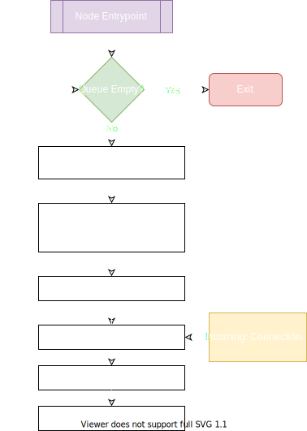
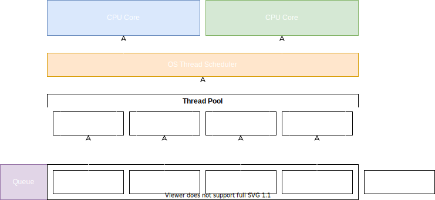

Node.js in of itself is a single-threaded application (if you want to call it that). However through the use of `libuv` and the underlying operating system, we can enjoy asynchronous capabilities. The question I'm going to hopefully answer, is how does this work?

## Node.js Event Loop

First, we need to have an understanding of how the event loop works in Node. The event loop is essentially an infinite while loop that waits for an instruction, executes it, and returns to waiting unless there are no more tasks in which case Node will gracefully shut-down.

There are a group of queue's which are called phases in Node nomenclature, each with a specific job.

* Timers - Executes callbacks scheduled by `setTimeout` and `setInterval`.
* Pending Callbacks - Executes I/O callbacks that have been deferred to the next loop iteration.
* Idle, Prepare - Used internally by Node.
* Poll - Get new I/O events and execute I/O callbacks
* Check - Executes callbacks registered with `setImmediate`
* Close Callbacks - Close certain callbacks such as `socket.on('close', ...)`.



I'm not going to go into detail about each of these phases in this post, but perhaps in the future I will. Until then you can [read about each phase in-depth](https://nodejs.org/en/docs/guides/event-loop-timers-and-nexttick/#phases-in-detail) over at the Node docs.

Each phase is an array/queue with a FIFO (first in, first out) list of callbacks. When Node enters a phase it will cycle through each queue and execute each callback until either the maximum number of callbacks is reached, or the queue length is zero.

An important detail to realize is that during any of these phases, additional callbacks can be registered and in some cases those callbacks won't get executed until the next loop iteration. You can use `setImmediate` to register a callback that gets executed, well, immediately. However you need to know what you're doing as you can cause the application to hang indefinitely in a scenario where `setImmediate` gets called recursively.

## Concurrency

The first thing to understand with Node.js and threads is that, as mentioned, Nod.js is single-threaded. It runs on one and only one thread for the duration of its lifetime. Write an infinite loop and you'll lock up your whole application. But concurrency or multi-threading does exist in this architecture.

As explained earlier I noted that Node.js defers I/O operations to the operating system. Take the `https` module for example.

```javascript
const https = require('https');
https.request('https://aaronarney.dev').then((response) => {});
```

If you are familiar with jQuery's `$.ajax` function, JavaScripts `xmlhttprequest` or `fetch` then you might think you know how this snippet is executed. However recall that Node.js uses V8 as essentially a type translator not as the underlying engine itself. When Node.js uses `https` requests, that request is passed to `libuv` and then `libuv` defers it to the operating systems networking libraries. 

Once that request hits the OS layer, Node.js knows that it will get notified when the OS returns some data so it decides to free up it's thread and work on something else until that happens, giving us asynchronicity. 

When the OS returns the data, Node.js gets notified that it's ready to get back to work processing the `https` request and pushes that task into poll queue. When a thread becomes available to process the request the original callback assigned to `https.request` gets executed with the data returned from the OS.



\*Note that by default, libuv uses 4 threads which can be increased using the \`process.env.UV_THREADPOOL_SIZE\`.

But the question we should be asking ourselves at this point is which parts of Node.js use this thread pool? The answer isn't easy because different OS's might decide to do different things. However it is somewhat safe to assume any intense operation such as reading and writing files, working with databases or networking will utilize the thread pool.

I never know how to end blog posts so I'll just leave it at that.