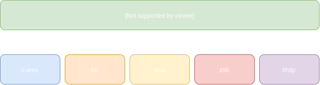
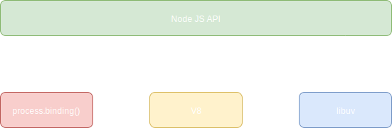

Node.js is an architecture that wraps several APIs into one consistent interface. There are several libraries which are encapsulated within Node.js and I want to provide a brief overview of what they are and how they are used.

In order to access the filesystem (I/O operations), asynchronous TCP/UDP sockets, child processes etc, Node.js utilizes the `libuv` library. It was originally developed to be used for Node.js but has since been adopted by several other platforms. This library is exposed through multiple modules such as the `fs` or `path` module. The `libuv` library is written in C/C++, this is important since it needs to be fast and cross-platform.

Complementing `libuv` is the `V8` engine, Google's JavaScript implementation that is used in Chrome, Edge, and other browsers. V8 implements both ECMAScript and WebAssembly, but does not have a DOM as that functionality is provided by a browser. V8 is mostly written in C++ with some JavaScript mixed in at some places.

There are a few more dependencies that Node.js has such as `llhttp`. This library extracts http message data such as:

- Headers
- Content-Length
- Methods
- Status Codes
- Request URLs
- Message body

If you've ever inspected a http request in your browsers networking debug tools, you've likely encountered this kind of data. Since Node.js's bread and butter is acting as a some sort of web server, it's easy to see why this library would be so important.

Next is `c-ares` which is a C library that Node.js utilizes to parse DNS requests asynchronously.

OpenSSL is another dependency that is used mostly for cryptographic functions and modules in Node.js. This library is exposed primarily through the `crypto` module in Node.js.

Lastly is `zlib` a really fast compression/decompression library. If you've worked on websites before you understand the value in `gzip`, well that's what `zlib` provides. Gzip compresses data that is sent to a client so that no unnecessary bandwidth is eaten up by serving assets in their raw form. This helps both performance and speed.

## C++ Bindings

Node.js exposes these underlying libraries through its own JavaScript API. When one API written in one language, ties into another API written in another language, it is often done so through what is known as a binding. If we take a look at the Node.js source code, there are two specific directories that I want to point out - `src` and `lib`.

The `lib` directory is where the JavaScript API is contained. This is where methods such as `fs.readFileSync` are contained. Bindings are bound through the `process.binding()` method.

The `src` directory is the C++ bindings that the `lib` modules call into. This is where most of the magic happens. 

### Conclusion

That is a _very_ brief overview of the internals of Node.js but there is so much more to get into. I only wanted to talk about how the libraries work and come together to make Node function the way it does.

