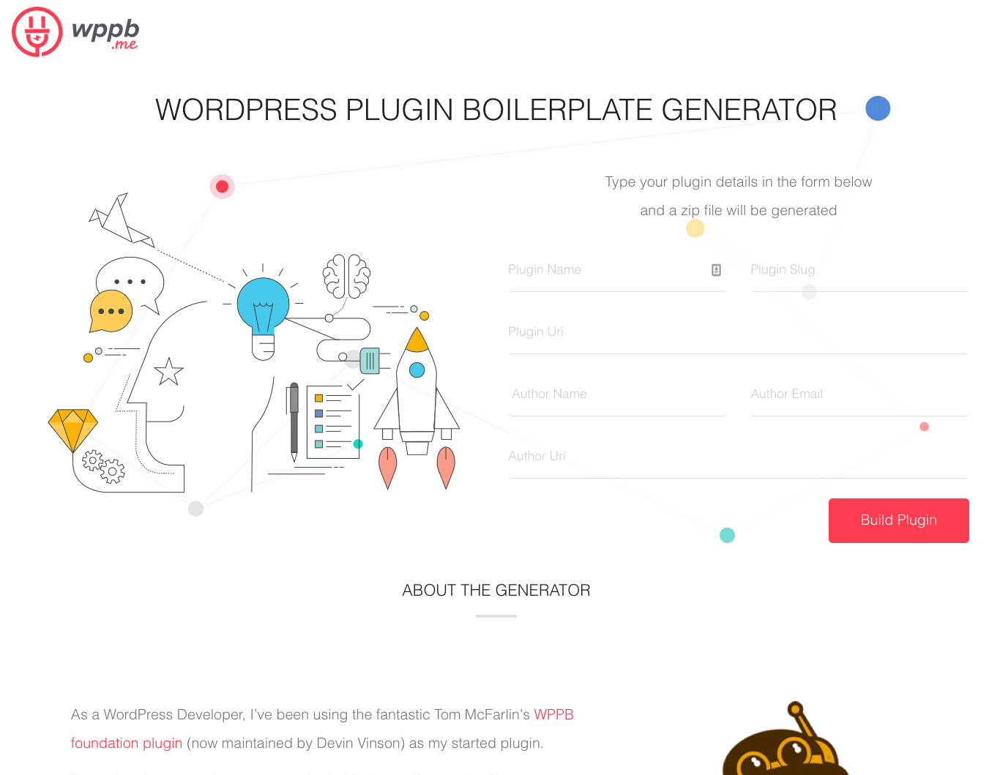

Recently I decided to begin leveraging the [Sentry](https://sentry.io) service for some of the WordPress sites I manage. I wanted to use this on several sites, and I noticed that Sentry has a PHP library but not an officially supported plugin for WordPress.

There was one other plugin in the directory, but it essentially only acted as an entry point in which to interface with Sentrys SDK. I was looking for a solution where I could upload the plugin, set my API key (or DSN in Sentry nomenclature) and just catch any and all errors with no configuration. I decided to just quickly write my own plugin.

## The Boilerplate

Usually, when I write a new plugin, I tend to head straight for the [WordPress plugin boilerplate generator](https://wppb.me/) to quickly create the plugin files.



I made a snap decision to just name the plugin **Ferret** because:

-   a) I love ferrets (used to own two!)
-   b) Due to trademarks, I can't really use my original idea of `WordPress Sentry` since both of those (I believe) are trademarked

### The SDK

The next step was to take a look at the integration documentation on Sentry's website. Luckily enough, they have a library for just about every language and framework you could realistically want in 2019. The PHP library is part of **composer**, so including that in the project was very simple.

```bash
composer require "sentry/sentry"
```

Next, I had to ensure the composer `autoloader.php` is called in my plugin. This would work perfect in the plugins entry point file - `ferret/ferret.php`.

```php
...
require_once __DIR__ . '/vendor/autoload.php';
...
```

Now was the time to initialize the Sentry client, which happens to be a class named `Raven_Client`. I put this logic in the base plugin class located in the `includes` directory - `ferret/includes/class-ferret.php`.

To follow the practice of single responsibility and to keep my functions small, I created a new function to initialize Sentry. Note that to keep my DSN and Project ID secret, I'm just using dummy text in their place.

```php
public function init_sentry() {
    $client = new Raven_Client( 'https://abc123@sentry.io/123' );
    $error_handler = new Raven_ErrorHandler( $client );
    $error_handler->registerExceptionHandler();
    $error_handler->registerErrorHandler();
    $error_handler->registerShutdownFunction();
}
```

The `$error_handler` here hooks into all errors that occur in PHP. This is desirable because I am wanting to just "set and forget" the client.

The last thing to do was call this function. The best place is to just call it during the construction of the class, so I added it to the `__constructor`.

```php
...
$this->init_sentry();
...
```

### Plugin Options

Writing code to handle options has gotten better than it used to be (I think), but it's still a somewhat confusing process. The way I've been accomplishing it lately is by creating a helper class to encapsulate my getters and setters for the native WordPress `get_option` function. Then passing an instance of that class to constructors of other classes, so they have a single access point for everything. This has reduced the need to arbitrarily pass around key strings and reduces the cognitive load.

Since quite a bit is going on to create these options, I don't want to write everything I did in this post, but it was essentially what I just outlined above. If you want to take a look and dissect my approach, you may find the following files of interest...

-   [Ferret_Public class](https://github.com/leap-spark/ferret/blob/master/public/class-ferret-public.php)
-   [Ferret_Options class](https://github.com/leap-spark/ferret/blob/master/includes/class-ferret-options.php)
-   [Public Display Partial](https://github.com/leap-spark/ferret/blob/master/public/partials/ferret-public-display.php)

#### Submission to Directory

I had never submitted a plugin to the WordPress plugin directory before, so this was all new to me. Luckily, WordPress has some fairly thorough resources for the process and what I should be cognizant of when submitting a new plugin.

Since this was a _very_ simple plugin, there wasn't too much to be worried about. There were only a few things I had to go "out of my way" to prepare for submission...

-   **Localization** - I had never generated this before but it was simple. I used the recommended app [Poedit](https://poedit.net/) to generate my english `.pot` file. For the uninitiated, you need to wrap all of your plain text that is visible to users with the native WordPress `__()` or `_e()` functions. This lets WordPress know that the strings are translatable.
-   **README.txt** - The readme is very important. This is where all of the critical information is placed, such as compatible versions, author data, descriptions, etc.
-   **SVN** - Once the plugin is approved, you are required to commit your code into an svn repository. This is a bummer but not the end of the world. SVN is truly awful in my opinion, but most of that opinion stems from lack of extensive use and understanding. The "svn way" is quite different than the "git way". When all was said and done, I think I had to publish around 7 versions just to rename a file.

#### Success!

My plugin was approved in just a day, which is surprising as they claim it can take up to two weeks for that to happen.

Next, I hope to extend the plugin to allow a user to easily set up custom filters and events much like how Unity works when setting up event handlers in the UI.

Thanks for reading!

##### Resources

-   [Plugin Git Repo](https://github.com/leap-spark/ferret)
-   [Plugin Homepage](https://wordpress.org/plugins/ferret/)
