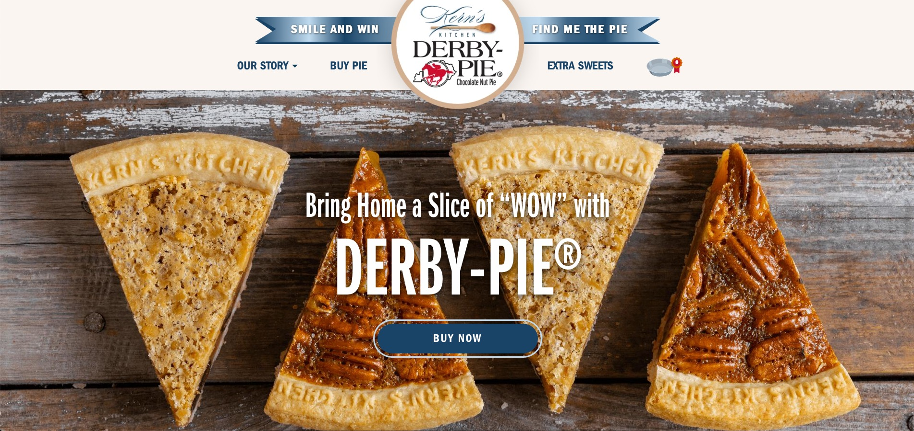

Kerns Kitchen's Derby Pie™ is a mainstay in Kentucky culture. Their pies are closely associated with the Kentucky Derby and for good reason, they are DOPE.

Kerns approached LEAP Spark for a website refresh as well as the ability to sell their products online. We assessed several platforms for this undertaking but ultimately fell on Shopify. This decision was based on a few factors, ease of use, PCI compliance, ability to tie into existing financial software and processes, ability to integrate with POS and lastly no managed software updates.

Since this was the first website I've ever built out in Shopify (minus a small proof of concept site I built when initially evaluating Shopify as a platform), there was a bit of a learning curve. Shopify's documentation leaves a bit to be desired, and I found myself confused at various points in development. Right off the bat, getting started was an issue for me. Shopify had developed a tool called Slate which managed a local installation, compiled your assets and generated a skeleton theme for you. This tool eventually became stagnant with tons of open Github issues. Eventually Shopify marked this tool as essentially dead in the water and instead focusing their efforts on other aspects of Shopify.

It wasn't until our second project with Shopify that I discovered a different tool for Shopify called [Theme Kit](https://shopify.github.io/themekit/). This tool is so much better for developing Shopify themes. It's simpler, requires less dependencies and can easily be used for CI/CD pipelines ([an issue I had with using Slate as I discuss in a blog post](./blog/azure-devops-pipeline-shopify/)).

The biggest issue I encountered was with their location finder feature. They maintained a huge database in Excel of locations with addresses on where to buy their pies. Since we were utilizing Google Maps to generate the pie icons for a location, I first needed to convert addresses to also include their latitude and longitude data. To do this I used MapQuests batch geocoding API. 

First I converted the Excel sheet to a CSV file. Next I converted the CSV file into a JSON structure. Lastly I used Postman to send this JSON data (in chunks due to limits) and receive the new lat/lon data I needed.

I saved this data to a JSON file and uploaded it with the theme. Now when the location finder loads it pulls the location data from this file. I had to do it this way because we were pressed for time and Shopify doesn't easily allow you to create any type of repeater custom fields on the back-end, making ease-of-use a bit difficult in this situation for the client. In retrospect, I think in this scenario it might have made sense to import this data into Airtable.js and use their REST API to generate this location map.

<a href="https://derbypie.com" class="bg-gray-300 hover:bg-gray-400 text-gray-800 font-bold py-2 px-4 rounded inline-flex items-center">Visit Derby Pie™</a>

