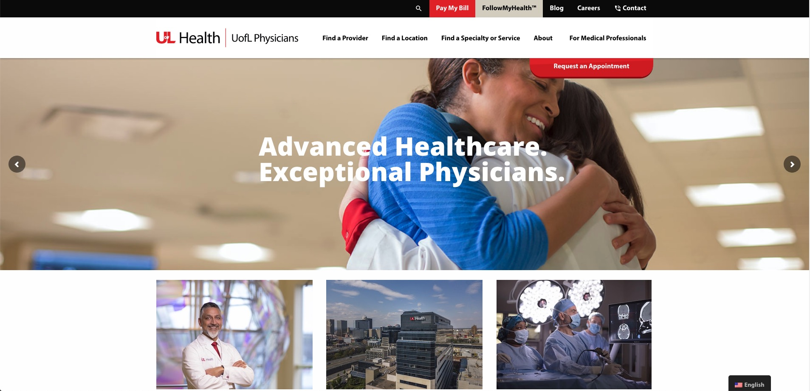
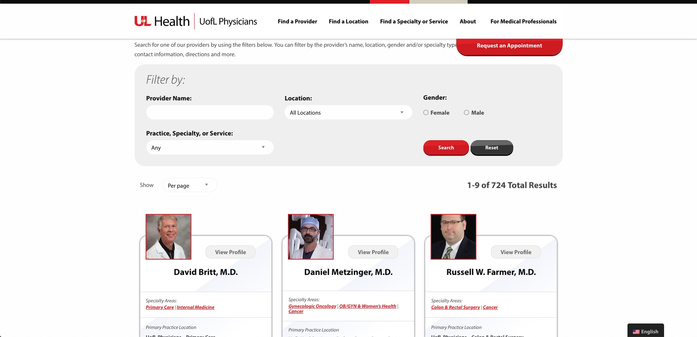

The University of Louisville Hospital needed a refreshed web experience as well as migration from a legacy Drupal setup to WordPress. The project took about a year due to several issues, but most notably was UofL's acquisition of Jewish Hospital.

UofL Physicians is as mentioned, built using WordPress in which a custom theme and plugins were developed. The theme was designed by [Sarah Powers](https://sarahpowers.pizza) with UX direction by LEAP Agencies [Kristen Haws](https://www.hidotty.com/).

Originally I had built out a totally custom search engine for the Find a Provider, Find a Specialty or Service and Find a Location pages. This "engine" performed search queries based on `meta_query` parameters in the `WP_Query` object. But I also had to perform a lot of optimization to make it fast, heavy utilizing caching, transients, priming, etc. However, after Jewish Hospital was merged I re-evaluated the engine and discovered I could heavily simplify the codebase while also making search queries perform near instantaneously by utilizing a plugin called FacetWP. I quickly prototyped out each of the search pages using FacetWP and was able to adopt this new method relatively easily.

I dove into how FacetWP works so that in the future I may be able to improve any custom search features I write from scratch. It cleverly creates its own database that serializes relationships between facets (parameters) and templates (output). After you create Facets you prime the database by triggering an index. This crawls your posts and builds this serialized database. Neat! That is something I had not considered doing, instead I relied heavily on native WordPress functions and queries to build these results on-demand. This works well for sites that don't have multiple layers of meta_query parameters with Advanced Custom Fields. But for larger sites with complex relationships, custom serialized database tables are the way to go.

<a href="https://uoflphysicians.com" class="bg-gray-300 hover:bg-gray-400 text-gray-800 font-bold py-2 px-4 rounded inline-flex items-center">Visit UofL Physicians</a>
